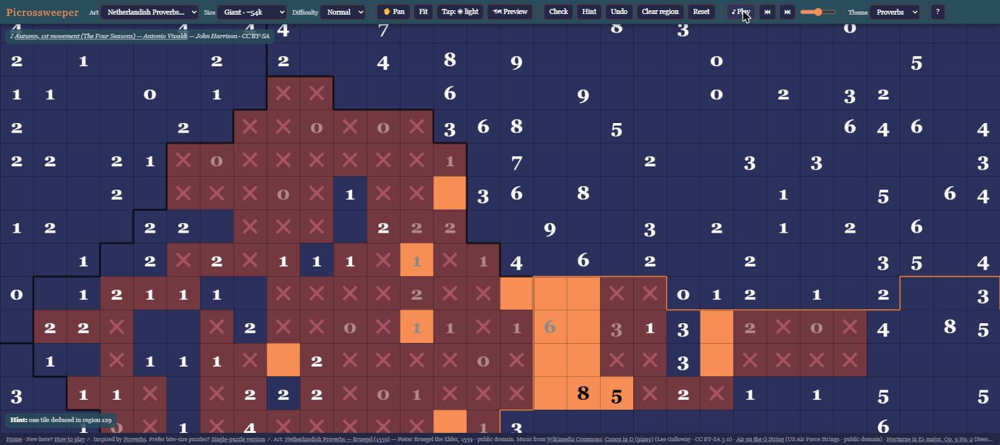
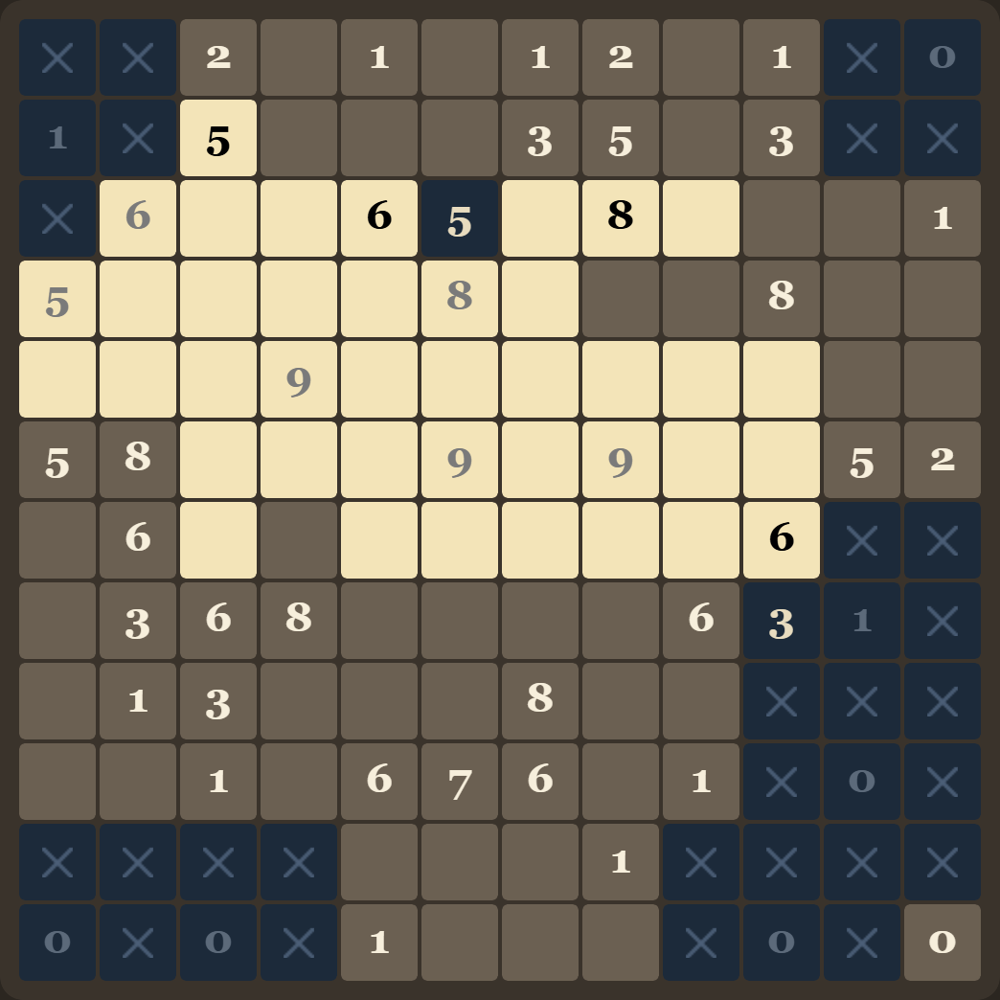
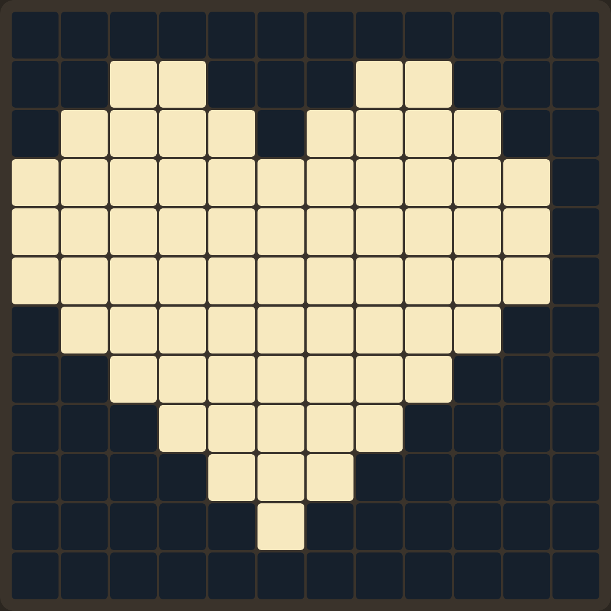
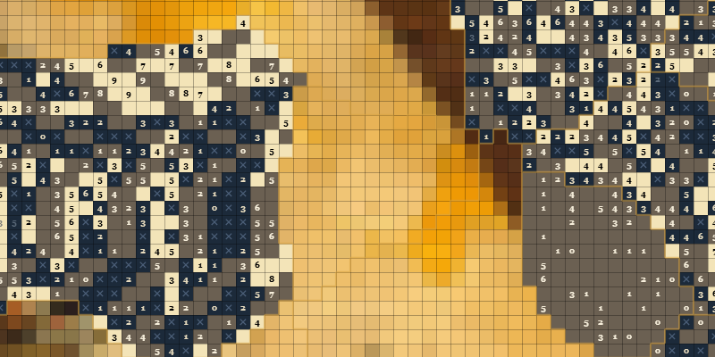
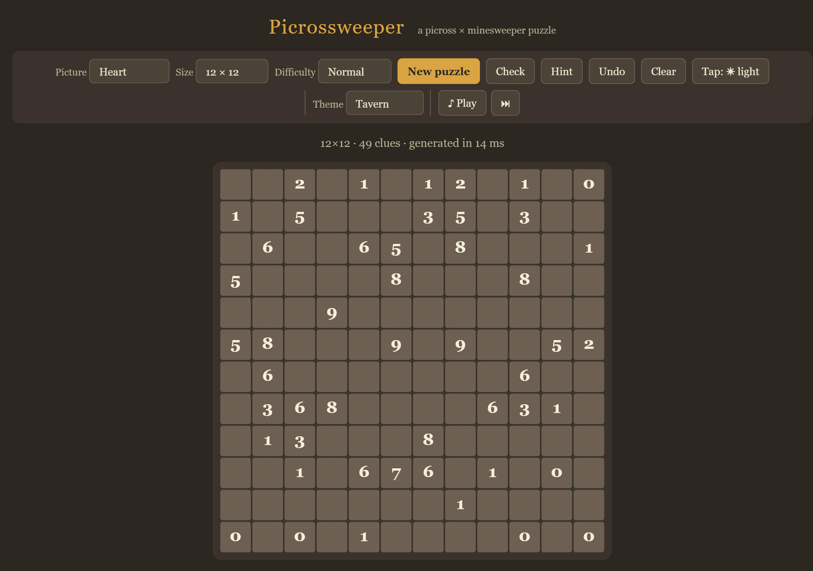

# Picrossweeper

A picross × minesweeper puzzle — solve the grid, uncover the picture.

**[Play it here](https://tomysaman.github.io/picrossweeper/)**

## Overview

Every tile on the board is secretly either **light** or **dark**. Some tiles carry a
number, and that number counts the light tiles in the 3×3 block around it —
including itself. That single rule is the whole game: mark tiles light or dark, use
each number to pin down its neighbours, and a hidden picture emerges from the grid
as you go. Every puzzle is generated so it can be solved by pure logic — there is
never anything to guess.

Picrossweeper comes in two forms:

- **Single puzzle** ([play it](https://tomysaman.github.io/picrossweeper/single.html)) — one board at a time, 10×10 up
  to 25×25, hiding a small piece of pixel art. Pick a picture, pick a difficulty,
  take as long as you like.
- **Giant grid** ([play it](https://tomysaman.github.io/picrossweeper/giant.html)) — one continuous painting, up to
  ~54,000 tiles, cut into hundreds of irregularly-shaped regions and panned and
  zoomed like a map. Solve one region at a time; the artwork appears behind you as
  you go.

A [visual tutorial](https://tomysaman.github.io/picrossweeper/tutorial.html) walks through the rule, every clue from 0 to 9,
and the two deductions that solve any board.

## Features

- **Two ways to play** — a small, self-contained single puzzle, or a giant
  region-by-region grid built from a full painting
- **Load your own art** — on the giant grid, drop in any image of your own and it
  becomes the puzzle
- **Background music** — a curated playlist of public-domain classical tracks,
  streamed from Wikimedia Commons, with play/pause, skip, and volume control
- **Adjustable size** — from a quick 10×10 to a giant ~54,000-tile canvas
- **Four difficulty levels** — Relaxed through Expert, trading off how many
  redundant clues survive pruning
- **Hint and Check** — reveal one logically-deducible tile, or highlight your
  current mistakes, without giving away the rest of the solution
- **Playable on mobile** — touch-friendly controls with a switchable tap mode for
  painting light or dark tiles with a single tap
- **Five colour themes** — Tavern, Proverbs, Nocturne, Dracula, and Neon, shared
  across every page
- **Progress saved automatically** on the giant grid, so a painting can be solved
  region by region over multiple sessions

## Rules

1. Every tile is either **light** or **dark** — nothing else.
2. Some tiles show a **number**. That number is the count of light tiles in the
   3×3 block centered on it (the numbered tile counts itself).
3. A tile with no number is just part of the picture — it still needs to be marked
   light or dark, but it gives no direct clue of its own.
4. Fill in every tile so all the numbers agree with the tiles around them, and the
   hidden picture appears.

**Controls:** left-click (or tap) to mark a tile light, right-click (or switch tap
mode) to mark it dark, click again to clear it. Drag to paint multiple tiles at
once. Use **Check** to flag mistakes and **Hint** to reveal one tile you could have
deduced yourself. On the giant grid, pan and zoom to move between regions — each
region is solved independently.

There's no guessing required: every generated puzzle can be fully solved by logic
alone, working outward from what each number rules in or out for its neighbours.

## Screenshots

| Mid-solve | Solved | Giant grid |
|---|---|---|
|  |  |  |

## Disclaimer

Picrossweeper is a playground project inspired by [Proverbs](https://www.proverbsgame.com/),
built with [Claude](https://claude.com/claude-code). Paintings and music are
streamed from [Wikimedia Commons](https://commons.wikimedia.org/).
